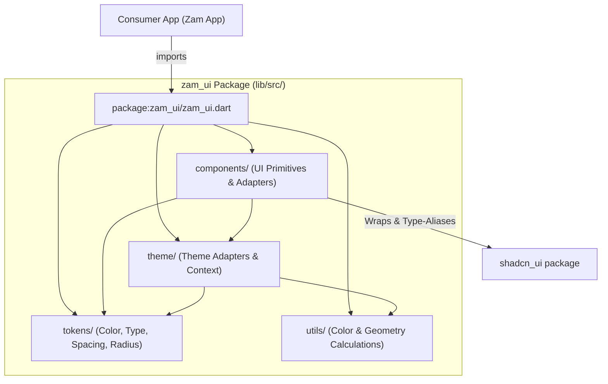

# zam_ui

[](https://github.com/mikezamayias/zam_ui/actions/workflows/ci.yml)

Private, app-agnostic Flutter UI foundation for cohesive Zam apps.

`zam_ui` provides configurable design tokens, shadcn theme generation, and
small reusable UI primitives. Apps own their fonts, icon package, routing, state
management, and brand presets.

## Architecture

`zam_ui` enforces a strict unidirectional dependency flow across modular layers. Higher layers depend only on lower layers, ensuring zero circular coupling:



- **Tokens (`lib/src/tokens/`)**: Pure configuration data contracts (`ZamColorTokens`, `ZamTypographyTokens`, `ZamSpacingTokens`, etc.) with zero widget dependencies.
- **Theme (`lib/src/theme/`)**: Bridges design tokens to the widget tree (`ZamTheme`, `ZamThemeData`, `ZamPreset`) and adapts to `ShadThemeData`.
- **Components (`lib/src/components/`)**: Visual UI primitives (`ZamButton`, `ZamSurface`, `ZamListTile`, `ZamFormField`, `ZamDialog`) and type-aliased shadcn widgets (`ZamCard`, `ZamInput`, `ZamTabs`).
- **Utils (`lib/src/utils/`)**: Standalone mathematical color & geometry utilities (`ZamColorUtils`, `ZamOklchColor`).

## Install

Local development:

```yaml
dependency_overrides:
  zam_ui:
    path: ../zam_ui
```

Private git dependency:

```yaml
dependencies:
  zam_ui:
    git:
      url: git@github.com:mikezamayias/zam_ui.git
      ref: v0.2.0
```

This package is intentionally marked with `publish_to: "none"` so it cannot be
published to public pub.dev by accident. To publish to a hosted private pub
repository, replace `publish_to` with that private repository URL and run
`dart pub publish` after configuring repository authentication.

## Configure

```dart
final ui = ZamThemeData(
  colors: ZamColorTokens.fromSeed(primary: brandColor),
  typography: const ZamTypographyTokens(
    fontFamily: 'Inter',
    monoFontFamily: 'JetBrains Mono',
  ),
  icons: ZamIconSet(
    info: MyIcons.info,
    success: MyIcons.check,
    warning: MyIcons.warning,
    error: MyIcons.error,
    back: MyIcons.back,
    chevronRight: MyIcons.chevronRight,
  ),
);

ZamTheme(
  data: ui,
  child: ShadApp.router(
    theme: ui.toShadThemeData(Brightness.light),
    darkTheme: ui.toShadThemeData(Brightness.dark),
    routerConfig: router,
  ),
);
```

### Fonts

`zam_ui` only consumes font family names through `ZamTypographyTokens`. Each
app is responsible for loading or registering those fonts before using them,
usually in the app's own `pubspec.yaml`:

```yaml
flutter:
  fonts:
    - family: Inter
      fonts:
        - asset: assets/fonts/Inter-Regular.ttf
        - asset: assets/fonts/Inter-SemiBold.ttf
          weight: 600
    - family: JetBrains Mono
      fonts:
        - asset: assets/fonts/JetBrainsMono-Regular.ttf
```

Then reference the family names from the app preset:

```dart
typography: const ZamTypographyTokens(
  fontFamily: 'Inter',
  monoFontFamily: 'JetBrains Mono',
),
```

### Brand Presets

Implement the `ZamPreset` interface to define type-safe brand configurations
for your app:

```dart
class MyAppPreset implements ZamPreset {
  const MyAppPreset();

  @override
  String get name => 'My App';

  @override
  ZamThemeData get light => ZamThemeData(
    colors: ZamColorTokens.fromSeed(primary: brandColor),
    typography: const ZamTypographyTokens(
      fontFamily: 'Inter',
      monoFontFamily: 'JetBrains Mono',
    ),
    icons: myIcons,
  );

  @override
  ZamThemeData get dark => light;
}
```

Then use the preset to configure `ZamApp`:

```dart
const preset = MyAppPreset();

ZamApp.router(
  theme: preset.light,
  darkTheme: preset.dark,
  routerConfig: router,
);
```

## Verify

```bash
dart run scripts/check_design_tokens.dart --self-test
dart run scripts/check_design_tokens.dart
dart format --set-exit-if-changed .
flutter analyze
flutter test
```
